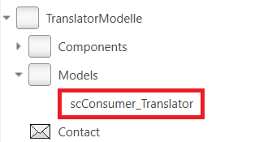
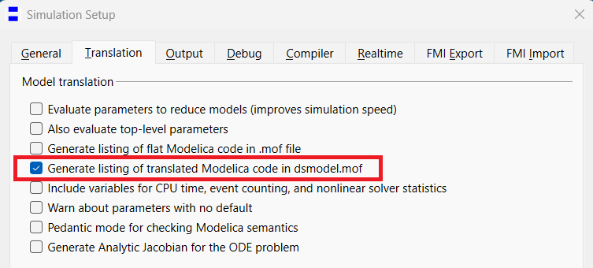
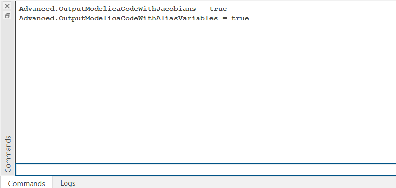
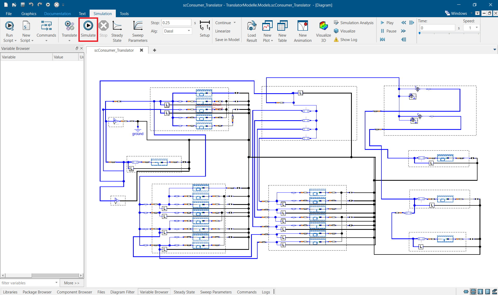
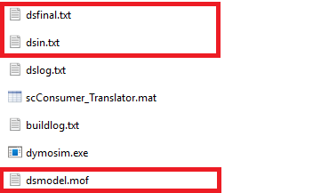
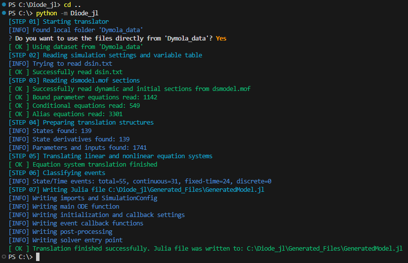
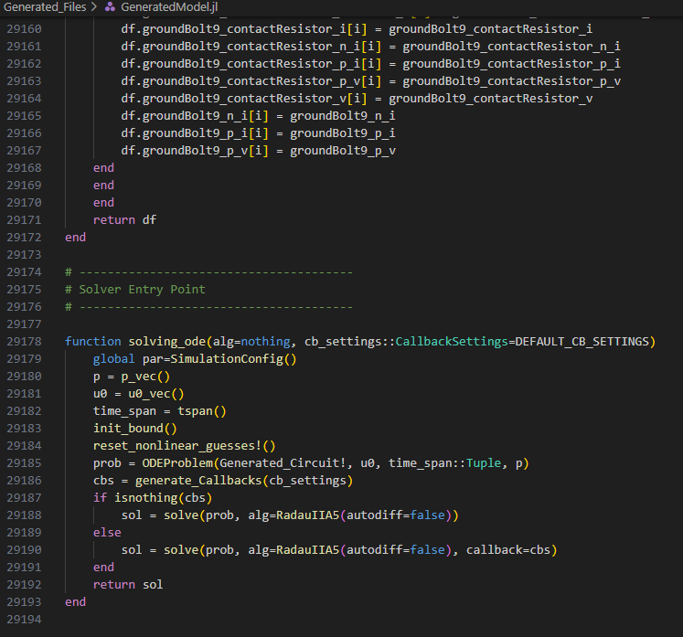

# Modelica Example: `TranslatorModelle_Paper.mo`

This directory contains the dedicated Dymola example model used to demonstrate the Diode.jl translation workflow on a concrete and reproducible test case.

The provided Modelica model represents a simplified vehicle electrical power supply system. It consists of interconnected components such as a battery source, wiring harness sections, conventional fuses, electronic fuse elements, electrical consumers, and ground connections.

The purpose of this example is to show, step by step, how a Dymola simulation model is translated into readable and executable Julia code using the Diode.jl translator. The example is intended for demonstration, validation, debugging, and methodological studies.

---

## What this example is for

The example model `TranslatorModelle_Paper.mo` is provided as a reference case for the translator workflow. It is used to:

- generate the compiled Dymola artifacts required by the translator
- validate the translator on a known example model
- inspect the generated Julia code on a manageable test case
- reproduce the end-to-end workflow from Dymola model to executable Julia model

This example is not only a Modelica model for simulation in Dymola. It also serves as a structured input case for the compiled-model-to-source-code workflow implemented in Diode.jl.

---

## Prerequisites

Before starting, make sure that the following tools are available:

- **Dymola** to translate and simulate the Modelica example model
- **Python** to run the Diode.jl translator
- **Julia** to execute the generated Julia model

In addition, make sure that the Diode.jl repository is available locally and that the translator can be started from your current repository setup.

---

## Step-by-step workflow

### 1) Open the example model in Dymola

Open Dymola and load the example model:

`TranslatorModelle_Paper.mo`

Navigate to the top-level model `scConsumer_Translator`, which is intended for simulation and translation.

<p align="center">
  
  <br>
  <em>Figure: Example model <code>TranslatorModelle_Paper.mo</code> opened in Dymola.</em>
</p>

---

### 2) Enable the required Dymola translation settings

Before running the simulation, enable the settings required by the translator.

In Dymola, go to:

**Simulation → Setup → Translation**

and enable:

- **Generate listing of translated Modelica code in `dsmodel.mof`**

In addition, set the following translation flags:

- `Advanced.OutputModelicaCodeWithJacobians = true`
- `Advanced.OutputModelicaCodeWithAliasVariables = true`

These settings are required so that Dymola writes the compiled model information in a form that can be processed by the translator.

<p align="center">
  
  <br>
  <em>Figure: Required Dymola translation settings for the translator workflow.</em>
</p>
<p align="center">
  
  <br>
  <em>Figure: Required Dymola translation settings for the translator workflow.</em>
</p>

---

### 3) Run the simulation in Dymola

Run the example model once in Dymola.

The translator does not operate directly on the graphical Modelica model. Instead, it reads the compiled artifacts generated by Dymola during translation and simulation. After a successful run, the relevant files are typically available in the Dymola run directory.

The required artifacts are:

- `dsmodel.mof`
- `dsfinal.txt`
- optionally `dsin.txt`, depending on the setup

These files contain the compiled equation structure and parameter information needed by the translator.

<p align="center">
  
  <br>
  <em>Figure: Example of the Dymola run directory containing the generated artifacts.</em>
</p>

---

### 4) Collect the generated Dymola artifacts

After the simulation has finished, collect the relevant output files from the Dymola run directory.

At minimum, the translator expects:

- `dsmodel.mof`
- and either `dsfinal.txt` or `dsin.txt`

Copy these files into the translator input folder, for example:

`Dymola_data`

Alternatively, keep them in another folder and select that folder when starting the translator, if your local translator version supports interactive folder selection.

<p align="center">
  
  <br>
  <em>Figure: Prepared Dymola artifacts for the translation step.</em>
</p>

---

### 5) Start the translator

Start the translator from the parent directory of the repository by running the configured package entry point of your local Diode.jl setup:

```text
cd ..
python -m Diode_jl
```
Depending on your current local repository structure, the exact launch command may differ. Use the entry point that is configured in your working Diode.jl installation.

The translator then performs the full workflow:

- reading the Dymola artifacts
- parsing the compiled equation structure
- analyzing the model representation
- generating the final Julia source code

When the translation finishes successfully, the generated Julia file is written, by default:

`GeneratedModel.jl`

<p align="center">
  
  <br>
  <em>Figure: Running the translator on the prepared Dymola artifacts.</em>
</p>

---

### 6) Inspect the generated Julia model

After the translation has completed, open the generated file:

`GeneratedModel.jl`

This file contains the translated model in readable Julia source code. Depending on the example and translator state, the generated file may include:

- model parameters
- state initialization
- ODE right-hand side logic
- algebraic equation blocks
- event handling and callback logic
- post-processing functions

The generated file is intended to be inspected, modified, versioned, and executed like regular Julia source code.

<p align="center">
  
  <br>
  <em>Figure: Example of the generated Julia code.</em>
</p>

---

### 7) Run the generated Julia model

Execute `GeneratedModel.jl` in Julia.

Then start the simulation with:

```julia
sol = solve_ode()
