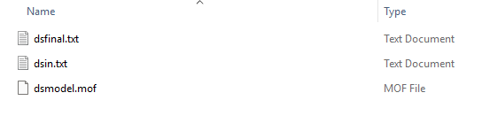
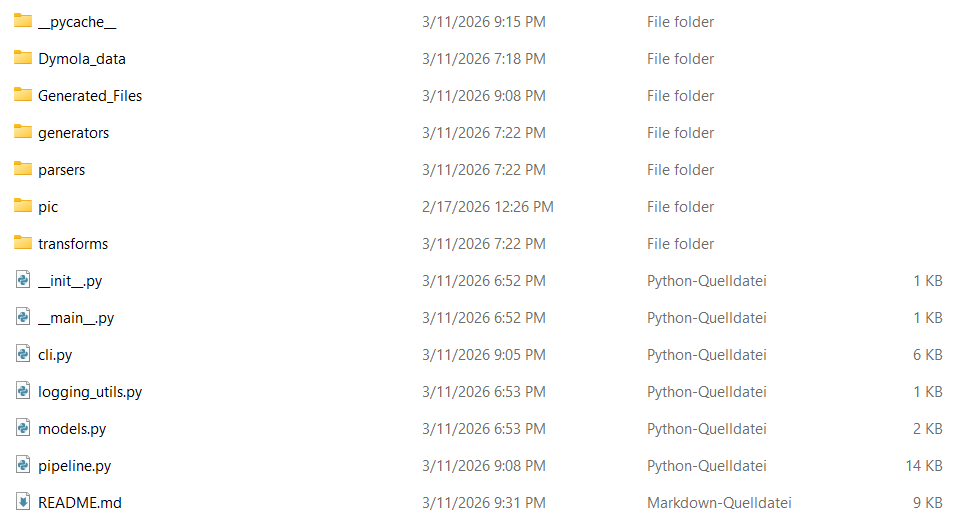
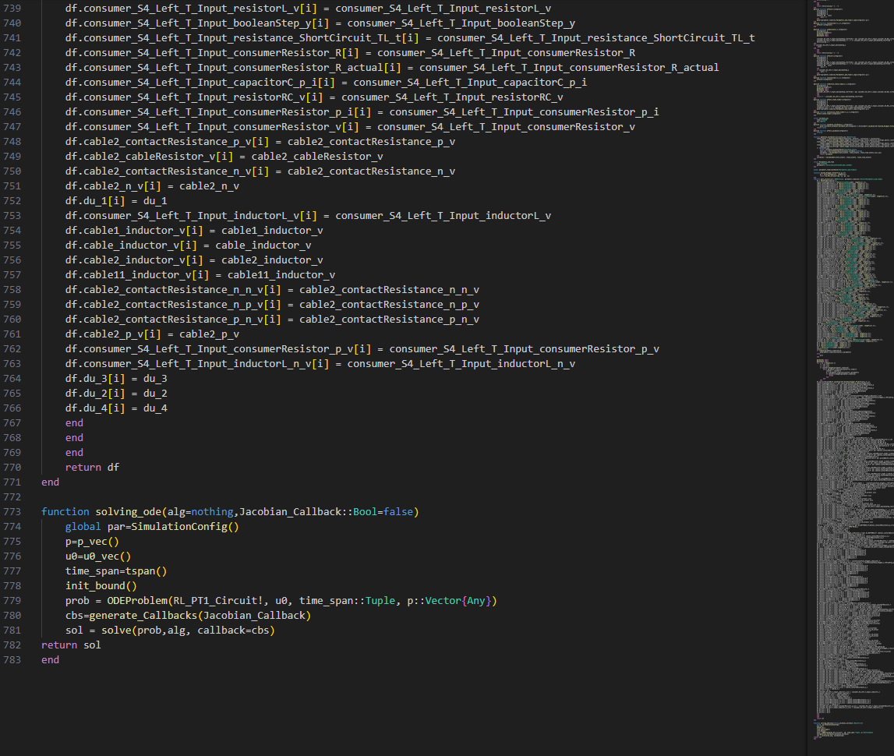

# Diode.jl

  

**Keywords:** Modelica, Dymola, Julia, SciML, DifferentialEquations.jl, code generation, acausal modeling, physical simulation, ODE, events, algebraic loops, reproducibility, debugging

Diode.jl is a software tool that converts the **compiled representation produced by the Dymola compiler** into **readable, executable Julia source code**. The goal is to make compiled model behavior visible and editable at the equation level, and to enable transparent numerical simulation, detailed debugging, and integration with Scientific Machine Learning workflows in Julia.

The translator is organized as a Python package and is started through its package entry point. Running the translator on a Dymola run directory generates a Julia file, by default `GeneratedModel.jl`, which can then be executed and modified like any other Julia source file.

Please refer to the Modelica_Example directory for the description of ...

---

## Highlights
- **Compiled-model to source-code workflow:** translates Dymola compiler outputs into plain Julia code.
- **Readable output for review:** generated code is intended to be inspected, versioned, reviewed, and edited.
- **Event handling:** supports time and state events via callback logic compatible with Julia’s solver ecosystem.
- **Algebraic structure exposure:** keeps algebraic couplings visible, including linear and nonlinear loops.
- **Modelica-constructs:** supports selected Modelica language constructs as they appear in the compiled representation, and normalization or removal of wrappers such as `noEvent(...)` and `smooth(...)` without changing the underlying algebraic expressions. Additional compiled-language patterns can be implemented in the translator as needed.
- **Research-oriented:** supports reproducible experiments and solver-level diagnostics.

---

## Scope
**In scope:** translation of compiled Dymola artifacts into executable Julia source code, preservation of evaluation order and event behavior at the compiled-model level, emission of a runnable Julia model with explicit event handling logic.  
**Out of scope:** a graphical modeling environment, a generic Modelica exchange or packaging format, full coverage of every Modelica construct across all tools, and performance benchmarking beyond what is required for correctness and diagnosis.

**NOTE:** The translator currently covers only a limited subset of Modelica language constructs. At this stage, support is focused on the constructs required by the **included example models** shipped with this repository (vehicle electrical system). To translate a broader range of Modelica features and models, the translator must be further developed and extended with additional Modelica construct handling.

--- 

## Workflow

1) **Run the Dymola simulation:** Start from a working Dymola model and run a simulation in Dymola. The translator requires the compiled artifact `dsmodel.mof` together with the standard Dymola result files such as `dsfinal.txt` and, depending on the setup, `dsin.txt`.

Before running the simulation, enable the following settings in Dymola:

- **Simulation → Setup → Translation:**  
  *Generate listing of translated Modelica code in `dsmodel.mof`*

- **Translation flags:**
  - `Advanced.OutputModelicaCodeWithJacobians = true`
  - `Advanced.OutputModelicaCodeWithAliasVariables = true`

2) **Prepare the Dymola artifacts:** After the simulation has finished, collect the relevant Dymola output files from the Dymola run directory. The translator expects at least `dsmodel.mof` together with either `dsin.txt` or `dsfinal.txt`.

You can either place these files directly into the repository folder **`Dymola_data`** or keep them in another folder and select that folder when starting the translator.

  
   
  <em>Figure: Dymola artifacts.</em>

3) **Run the translator:** Start the translator from the **parent directory of the repository** and execute the package entry point:
`python -m Translator_Github`

  
   
  <em>Figure: Repository structure of Diode.jl translator.</em>

4) **End-to-end translation (orchestration):** The translator entry point acts as the driver for the complete translation process. It calls the required sub-scripts and internal functions to read the Dymola artifacts, parse the compiled equation structure, analyze the model representation, and generate the final Julia source code. When the script finishes and prints `[ OK ] Translation finished successfully...`, the translation has completed.

5) **Run the generated Julia model:** The translation produces a Julia file named **`GeneratedModel.jl`** that contains the translated model. Execute `GeneratedModel.jl` in Julia, then run the simulation with:
`sol = solve_ode()`.
This returns the numerical solution object. To compute the observable quantities from the simulated states, run `df = post_process(sol, parameter_timeline)`.

  
   
  <em>Figure: GeneratedModel.jl example.</em>

## Requirements
- **Dymola:** to produce the compiled input artifacts (Translate step required, Simulate recommended, recommended: Dymola 2024x or newer)
- **Python:** to run the translator package (recommended: Python 3.10 or newer)
- **Julia:** to run the generated code (recommended: Julia 1.11.6 or newer)
- **Julia packages:** the generated code is intended for the Julia SciML ecosystem and typically requires `DifferentialEquations.jl` (recommended: 7.17.0 or newer). The exact imports are listed at the top of `GeneratedModel.jl`.

---

## Modelica Language Coverage

> Coverage refers to constructs as they appear in Dymola’s compiled output (`dsmodel.mof`), not full source-level Modelica coverage.

| Modelica language construct | Function implemented | Coverage | Notes |
|---|---|---|---|
| Assignment `:=` | Yes | Full | Rewritten to `=` in generated Julia equations. |
| Derivative `der(x)` | Yes | Full | Converted to internal form and mapped to state derivatives (`du[i]`) where available. |
| Hierarchical names `a.b.c` | Yes | Full | Converted to Julia-safe identifiers (`a_b_c`). |
| `time` | Yes | Full | Rewritten to `t`. |
| Boolean ops `and`, `or`, `not` | Yes | Full | Rewritten to `&&`, `\|\|`, `!`. |
| `if ... then ... else ...` (expression form) | Yes | Partial | Rewritten to Julia ternary form (`cond ? a : b`) for compiled equation expressions. |
| `when / elsewhen / end when` | Yes | Partial | Converted to callback-oriented logic for event handling. |
| `sample(...)` in event logic | Yes | Partial | Handled through generated callback/event pipeline from compiled equations. |
| `integer(...)` | Yes | Partial | Rewritten to `floor(Int, ...)` in current implementation. |
| `noEvent(...)` | Yes | Syntax only | Wrapper is removed. Event-suppression semantics are not explicitly preserved. |
| `smooth(order, expr)` | Yes | Syntax only | Wrapper is removed. Smoothness annotation is not explicitly preserved. |
| Linear system blocks (compiled tags) | Yes | Partial | Recognized from compiled tags and translated into explicit linear solve code. |
| Nonlinear system blocks (compiled tags) | Yes | Partial | Recognized from compiled tags and translated into nonlinear solve code. |
| `pre(x)` | No | - | -

> Note: Constructs outside these compiled patterns are currently not guaranteed and may require extending the translator.

## Contributing
Contributions are welcome and highly appreciated.

1. Fork the repository
2. Create a feature branch  
3. Commit your changes  
4. Push the branch  
5. Open a Pull Request and describe:
   - the motivation and scope of the change
   - how to reproduce and test it
   - any limitations or follow-up work

Please keep changes focused, add or update documentation where relevant, and include tests if available.

